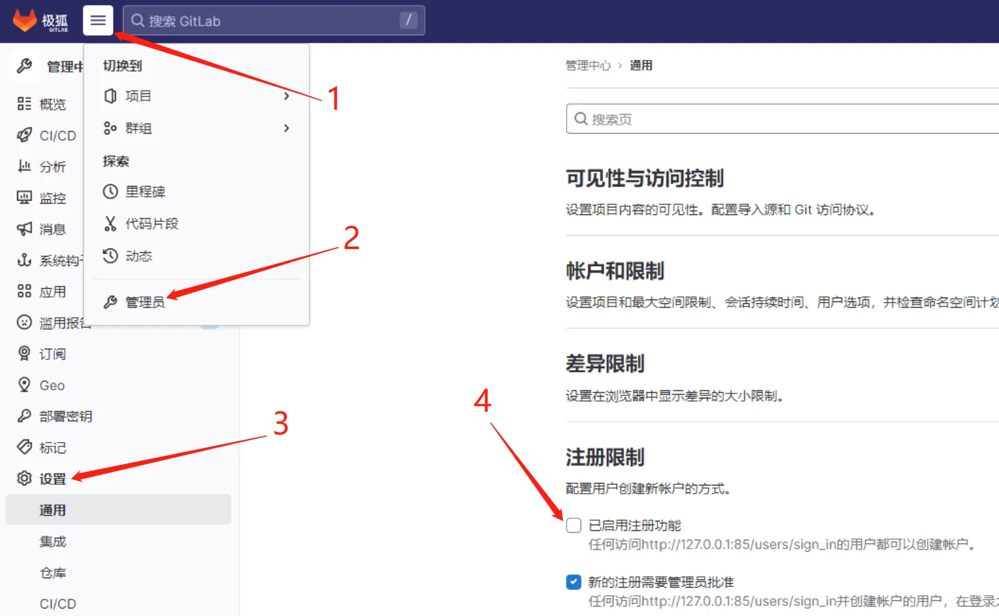

# 1. gitlab安装前准备
 - 系统版本：Ubuntu 22.04.1 LTS

## 1.1 更新系统环境
``` 
  sudo apt update
  sudo apt upgrade
```
## 1.2 安装和配置必须的依赖项
```shell
sudo apt-get install -y curl openssh-server ca-certificates tzdata perl
sudo apt-get install curl
```

## 2.下载和安装gitlab

## 2.1  下载指定的版本
```shell
curl -s https://packages.gitlab.com/install/repositories/gitlab/gitlab-ce/script.deb.sh | sudo bash
```

## 2.2 开始安装
注意：localhost为访问gitlab的地址，85为访问gitlab的端口号

```shell
sudo EXTERNAL_URL="http://localhost:85"  apt-get install gitlab-ce=15.9.3-ce.0
```

除非您在安装过程中指定了自定义密码，否则将随机生成一个密码并存储在 ``` /etc/gitlab/initial_root_password ```文件中(出于安全原因，24 小时后，此文件会被第一次 gitlab-ctl reconfigure 自动删除，
因此若使用随机密码登录，建议安装成功初始登录成功之后，立即修改初始密码）。使用此密码和用户名 root 登录。


## 2.3 GitLab配置
### 2.3.1 修改访问Gitlab服务的地址以及端口
 ```shell
 sudo vim /opt/gitlab/embedded/service/gitlab-rails/config/gitlab.yml
 ## GitLab settings
  gitlab:
    ## Web server settings (note: host is the FQDN, do not include http://)
    host: localhost
    port: 85
    https: true
```

### 2.3.2 修改外部访问GitLab的地址   

```shell
# 编辑gitlab.rb文件
sudo vim /etc/gitlab/gitlab.rb
# 找到external_url这一项，
external_url 'http://服务器ip地址:端口'
```

### 2.3.3 重新激活配置文件
```shell
# 重新加载配置文件
 sudo gitlab-ctl reconfigure
 或
# 重启服务
 sudo gitlab-ctl restart
```


## 2.4 启动GitLab
第一次在浏览器打开时可能会报502错误，可以重启GitLab服务解决。
登录账户：root
查看第一次安装GitLab生成的默认密码：``` sudo cat /etc/gitlab/initial_root_password ```

### 2.4.1 修改root账户密码


### 2.4.2 关闭GitLab新用户注册功能



# 3. 命令操作
## 3.1 常用命令使用：
```
gitlab-ctl start      # 启动所有 gitlab 组件；
gitlab-ctl stop       # 停止所有 gitlab 组件；
gitlab-ctl restart    # 重启所有 gitlab 组件；
gitlab-ctl status     # 查看服务状态；
gitlab-ctl reconfigure        # 刷新配置文件；
vim /etc/gitlab/gitlab.rb     # 修改默认的配置文件；
gitlab-rake gitlab:check SANITIZE=true --trace    # 检查gitlab；
gitlab-ctl tail        # 查看日志；
```
## 3.2 命令操作数据备份和恢复
数据迁移要求：
- 源主机和目标主机的gitlab版本要求一致

源主机执行备份：
```shell
sudo gitlab-rake gitlab:backup:create
# 备份文件会自动存储到目录：
/var/opt/gitlab/backups/
```
-----------
将备份的数据移动到目标主机并放到指定路径：```/var/opt/gitlab/backups/```

目标主机执行恢复
```shell
# 停止相关数据连接服务：
sudo gitlab-ctl stop unicorn
sudo gitlab-ctl stop sidekiq
# 修改权限，怕文件因为权限问题无法恢复数据:
sudo chmod 775 /var/opt/gitlab/backups/1644308851_2022_02_08_13.3.5_gitlab_backup.tar
# 从备份中恢复数据：
sudo gitlab-rake gitlab:backup:restore BACKUP=1644308851_2022_02_08_13.3.5
# 备份完重启gitlab
gitlab: sudo gitlab-ctl start
```

# 4. 升级gitlab版本
[查看可用的版本](https://packages.gitlab.com/gitlab/gitlab-ce)
```
wget --content-disposition https://packages.gitlab.com/gitlab/gitlab-ce/packages/ubuntu/jammy/gitlab-ce_15.9.8-ce.0_amd64.deb/download.deb
// 安装
dpkg -i ~/gitlab-ce_15.9.8-ce.0_amd64.deb

// 重启
gitlab-ctl restart
gitlab-ctl reconfigure
```

# 5.参考链接：
 - [gitlab升级降级操作步骤](https://docs.gitlab.com/ee/update/index.html#upgrade-paths)
 - [gitlab版本发布](https://packages.gitlab.com/gitlab/gitlab-ce)
 - [gitlab数据迁移恢复](https://blog.csdn.net/m0_55470263/article/details/122838039)