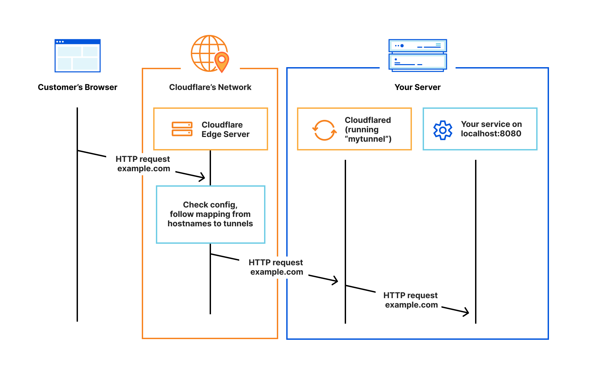

# Cloudflare Tunnel
cloudflare 提供的免费加密通道，通过 cloudflare 的 cnd 访问部署在内网的服务，比如 web,ssh,smb,tcp 等。
其工作方式类似于 frp，可以将本地服务发布到公网。只不过 frp 所需的服务器 IP 在 Cloudflare Tunnel 中变成了 Cloudflare 提供的节点。
相比于 frp 省去了服务器的成本。




# 1.准备
## 1.1 先决条件
1. 必须需要一个 cloudflare 账号，以及开通 cloudflare zero trust。
  - cloudflare：https://www.cloudflare.com/
  - zero trust: https://one.dash.cloudflare.com/
2. 在你的需要内网穿透的设备上安装 cloudflared（cf 的本地 cli 客户端）
   - ubuntu/centos amd64架构 ``` curl -L 'https://github.com/cloudflare/cloudflared/releases/latest/download/cloudflared-linux-amd64' -o /usr/bin/cloudflared  && chmod +x /usr/bin/cloudflared```
   - arm64 ``` curl -L 'https://github.com/cloudflare/cloudflared/releases/latest/download/cloudflared-linux-arm64' -o /usr/bin/cloudflared
     chmod +x /usr/bin/cloudflared ```
     
3. 用命令登录cloudflared
 - ``` cloudflared tunnel login ```
      ```
      终端会给出一个类似 https://dash.cloudflare.com/argotunnel?callback=https%3A%2F%2Flogin.cloudflareaccess.org%xxxxxxxxxxxxxxxxxxxxxxx 的登陆地址，复制黏贴该地址到浏览器中，然后按照要求登录即可。
    如果是有二步验证的，需要登录了以后，再次黏贴该地址，因为二步验证结束后并不会自动跳转到该 cloudflared 验证登录页面。
    
    授权的话，每次只能选择一个网站，当然，一个网站也就够用了，我们可以解析很多三级域名。
    
    当然如果需要授权多个网站，授权完成后不要关闭网页！依次点击其他需要授权的域名，进行多次授权。 
     ``` 
  

# 2. 在目标机器上设置要转发SSH服务器
授权完成后，就可以创建我们需要的隧道了。cloudflare 提供两种方式;
1. 一种是在 zero trust 页面用 web 添加授权
2. 在本地服务器（raspberry）上用 config 文件添加

下面用的是 config 文件添加，因为本地 config 更方便操作一些,如果有多台服务器，那么可以在不同的服务器安装多个Cloudflared，配置多个Tunnel
### 2.1 创建tunnel
创建完以后，会把信息保存到 root 下的 .cloudflared 文件夹下，注意不要误删了

 - ``` cloudflared tunnel create <你的隧道名字> ```
 - 示例： ``` cloudflared tunnel create amd-test ```

### 2.2 创建域名 CNAME
添加一个域名:

- ``` cloudflared tunnel route dns <隧道名字> <域名> ```
- 示例``` cloudflared tunnel route dns amd-test test.hujian.xyz```

然后 cloudflare 就会在你的域名下自动生成一个 CNAME，把 test.hujian.xyz 指向 <隧道 UUID>.cfargotunnel.com

以此类推，我们可以如法炮制在面板上添加其他的需要的 CNAME


### 2.3 配置 Config 文件
添加好想要穿透的域名后，我们就可以开始映射了。 
```shell 
# vi  ~/.cloudflared/config.yml

tunnel: <隧道UUID>
credentials-file: /root/.cloudflared/<隧道UUID>.json

ingress:
  - hostname: test.hujian.xyz
    service: ssh://localhost:22
  - service: http_status:404

```
注意：最后的 - service: http_status:404 一定要加，这是兜底的规则。还有复制黏贴的时候确保格式没有错误，很可能会发生 mapping error。

### 2.4 配置完以后，可以测试下配置文件是否有问题。

```sh 
# cloudflared --config ~/.cloudflared/config.yaml  tunnel ingress validate
Validating rules from /root/.cloudflared/config.yaml
OK

```

### 2.5 启动服务
如果不指定配置文件路径，cloudflared 会默认读取 ~/.cloudflared/config.yml

``` cloudflared tunnel --config [配置文件路径] run ```
示例：``` cloudflared tunnel --config config.yaml  run ```

# 3. 创建 systemctl 开机自启动服务
``` 
cloudflared service install
systemctl start cloudflared
systemctl enable cloudflared
systemctl status cloudflared
```


# 4. SSH 客户端使用
### 4.1 客户端也要安装cloudflared，参考准备-先决条件

### 4.2 更改 SSH 配置文件
```sh 
$ vi ~/.ssh/config

Host ssh.example.com
ProxyCommand /usr/local/bin/cloudflared access ssh --hostname %h

```

### 4.3 运行ssh命令访问服务器
``` ssh <username>@ssh.example.com ```

运行该命令时，cloudflared将生成连接，提示您在从终端建立连接之前通过您的身份提供者进行身份验证。
- 示例：
```json
https://test.hujian.xyz/cdn-cgi/access/cli?edge_token_transfer=true&redirect_url=https%3A%2F%2Fgo.hujian.xyz%3Ftoken%3Dr2BxxxmiFzTisCZxN8KJtm_wjTyFHK3E%253D&send_org_token=true&token=r2xxxxzxxx_wxyFHK3E%3D
```

# 5 参考
 - [EdNovas 的小站](https://ednovas.xyz/2023/02/24/cloudflaretunnel/#SSH%E5%8D%8F%E8%AE%AE)
 - [官方连接-SSH through Cloudflare Tunnel](https://developers.cloudflare.com/cloudflare-one/connections/connect-apps/use_cases/ssh/)