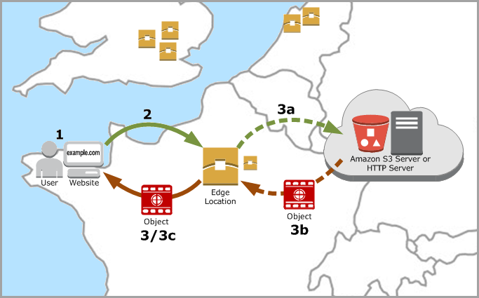

# 1. shadowsocks 服务端部署

## 1.1 环境准备
 - [亚马逊海外EC2服务器](https://us-east-1.console.aws.amazon.com/ec2/home)
 - [亚马逊CDN服务(cloudfront)](https://us-east-1.console.aws.amazon.com/cloudfront/v3/home)
 - ubuntu 18.04版本以上，建议使用最新的ubuntu版本
 - 域名 


# 2. 基于ubuntu 宿主机安装
1. 一键安装脚本自生成https证书，执行脚本前必须域名与服务器IP进行关联
2. 移植一键安装脚本到目标服务器
    ```scp ./for_ubuntu/auto-deploy-ubuntu.sh  root@proxy.domain.com:/tmp```
3. 在目标服务器上执行一键安装脚本
   ```sh 
      cd /tmp 
      chmod 775 auto-deploy-ubuntu.sh 
      ./auto-deploy-ubuntu.sh proxy.domain.com
   ```
说明：proxy.domain.com 替换为你的域名   

# 3. 基于docker 安装
1. 安装docker 环境, 移植安装docker脚本到目标服务器 
 ```scp ./for_ubuntu/auto-docker.sh  root@proxy.domain.com:/tmp``````

2. 在目标服务器上执行安装docker脚本
   ```sh 
      cd /tmp 
      chmod 775 auto-docker.sh
      ./auto-docker.sh
   ```
3. 安装shadwsocks 镜像服务
 ```sh
   scp ./for_docker/docker-compose.yaml root@proxy.domain.com:/tmp
   // 在目标服务器上执行命令
   mkdir ss-docker 
   cd ss-docker
   mv /tmp/docker-compose.yaml .
   chmod 775 docker-compose.yaml
   // 目标服务器下载shadwsocks镜像
   docker-compose pull   
 ```

4. 生成https证书，这里示例使用lego的方式生成https证书，生成的证书路径默认在执行命令的当前目录```.lego/certificates/```
```shell
CLOUDFLARE_EMAIL="xx@gmail.com" 
CLOUDFLARE_API_KEY="域名管理api KEY (for dns api key)" 
lego --email "xx@gmail.com" --dns cloudflare --domains "*.domain.com" run
```

   
5. 把生成的https证书移植到ss-docker的tls目录下
  ```
  cp .lego/certificates/_.xx.com.crt ~/ss-docker/tls/tls.crt 
  cp .lego/certificates/_.xx.com.key  ~/ss-docker/tls/tls.key
 ```

6. 修改docker-compose.yaml文件中的 ```-host=domain```  将domain改为你的域名
7. 启动docker服务器生效
   ``` docker-compose up -d ```

# 4. 亚马逊CDN服务(cloudfront)
使用CDN的目的是可以用缓存的方式达到访问加速的作用

## 4.1 CDN数据转发流程
- A.example.com->cloudfront->B.example.com->ip.ec2.port



## 4.2 CDN配置步骤
1. cloudfront配置A.example.com域名的ca证书
2. cloudfront配置回源地址B.example.com
3. cloudfront配置源请求策略 ```Managed-AllViewerExceptHostHeader```


# 5. 总结
总结下来需要掌握的技术点：
1. docker、docker-compose的安装和简单使用
2. 域名管理
3. CDN配置
4. https证书签发

# 6. 参考文档
- [CloudFront内容交付流程](https://docs.aws.amazon.com/AmazonCloudFront/latest/DeveloperGuide/HowCloudFrontWorks.html)
- [CloudFront配置说明-源请求参考文档](https://docs.aws.amazon.com/AmazonCloudFront/latest/DeveloperGuide/using-managed-origin-request-policies.html)
- [使用lego手动生成tls证书参数文档](https://go-acme.github.io/lego/dns/)


