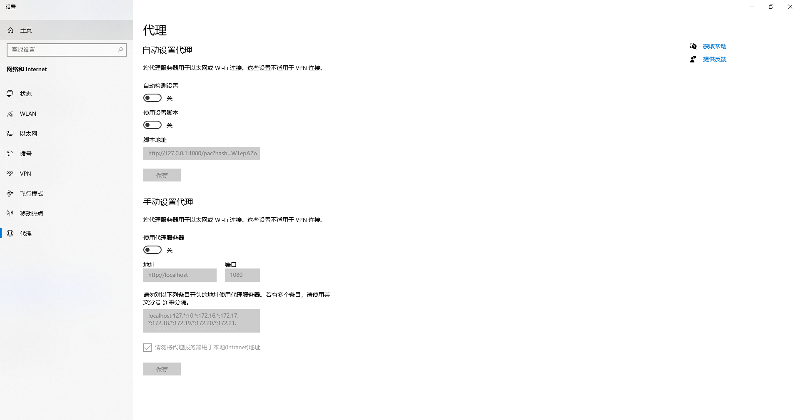
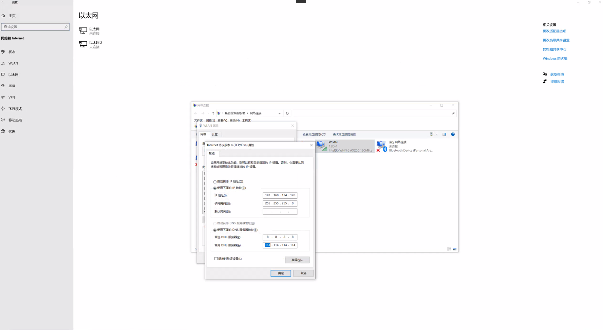

# 网络错误 ERR_CONNECTION_TIMED_OUT
``` 
无法访问此网站www.google.com 的响应时间过长。
请试试以下办法：

检查网络连接
检查代理服务器和防火墙
运行 Windows 网络诊断
ERR_CONNECTION_TIMED_OUT
```
1、使用终端ping www.baidu.com查看网络，不通就要检查网络连接了

2、查看网页的代理是是否关闭，具体步骤： 设置->高级->系统->打开您计算机的代理设置->关闭所有代理


3、检查以太网： 具体步骤：  网络->更改适配器选项->以太网->TCP/IPv4属性->设置DNS

