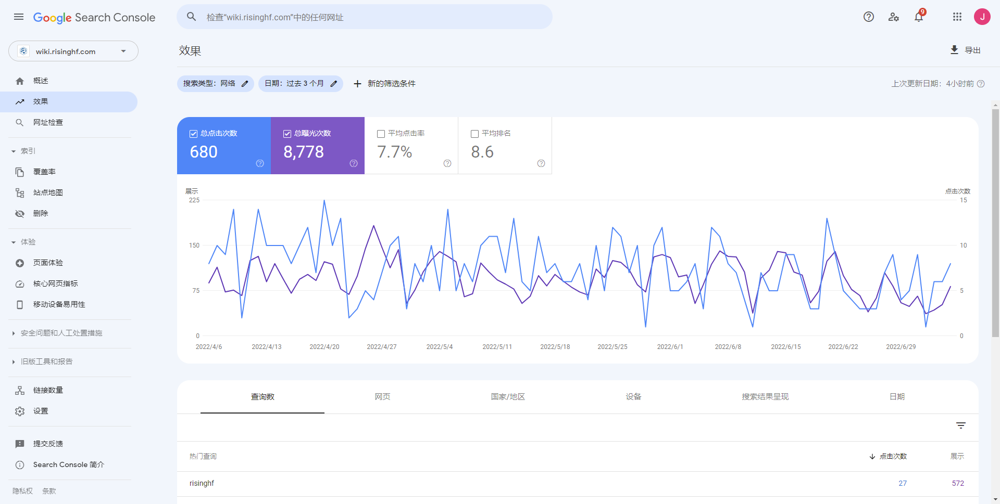
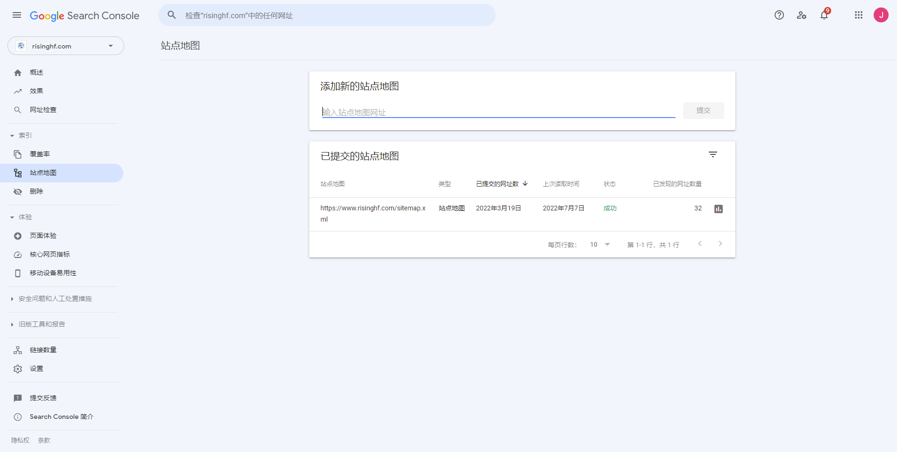
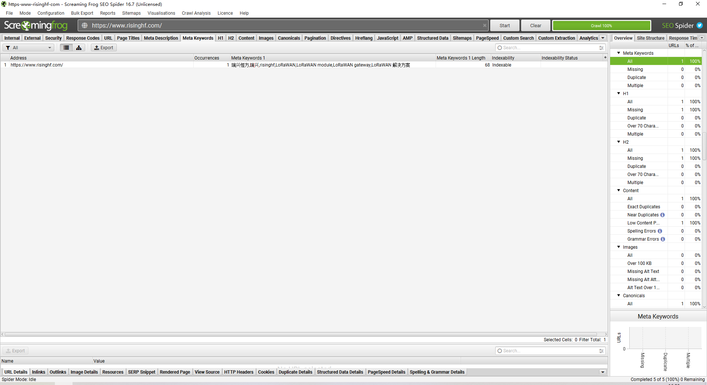

# seo网站搜索优化

搜索排行问题，主要是两方面优化方向：
* 第一是外链引用
* 第二是让搜索引擎的爬虫能收录/分析页面中的文本

技术相关的是第二，针对技术上的解决方案:

1. 分析是否指定的浏览器才能展示结果，比如google游览器能正常访问网页，IE游览器访问 404，这样会影响搜索引擎的爬虫对真实内容的爬取，搜索引擎收录到这样的页面，一个相关的词都没有，搜索索引是没法建立的。解决方案是去掉这个判断逻辑。


2. 网站是动态内容，且没有提供sitemap文件。这样的话，意味着即便没有第一个问题，搜索引擎也只会收录到了根页面，其它主页面、各个产品页，是不可能被收录到的，关键词索引也无从建立。解决方案是通过工具自动/手动生成一个根目录sitemap文件，和前端页面一起部署。

3. 在网关title加上name为keywords和description 以及对应的content描述 
  - 示例：
```xml
<meta name="keywords" content="瑞兴恒方,瑞兴,risinghf,LoRaWAN,LoRaWAN module,LoRaWAN gateway,LoRaWAN 解决方案"><meta name="description" content="....">
```

4. 通过Google/百度站点管理工具分析数据，通过此分析
   官网相关的关键列表、搜索率、点击率等指标在一定时间范围内的变化，一个是看之前是什么状态，另外一个
   要看解决了这两个问题后，后面有没有得到改进。


# 辅助分析工具
 目的：
 * 1.提交seo收录，sitemap站点地图; 
 * 2.分析网关排名以及关键字
## 百度站长
- https://ziyuan.baidu.com/site/index#/ 
## google站长
- https://search.google.com/search-console



分析网站关键字收录情况(Screaming Frog SEO Spider)
- https://www.screamingfrog.co.uk/seo-spider/



# 参考
 
- [seo优化](../book/SEO教程：搜索引擎优化入门与进阶（第3版）.mobi)